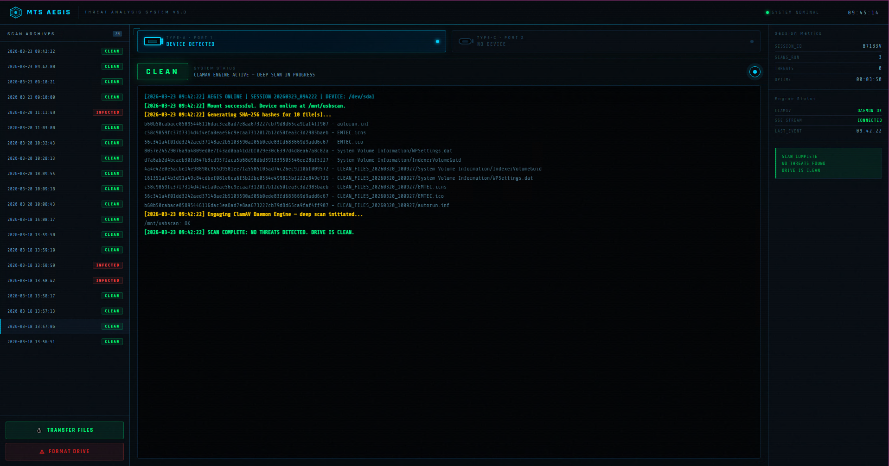

# MTS Aegis — USB Threat Analysis System


An air-gapped USB malware scanning appliance for corporate environments. Plug in an untrusted USB drive, get a real-time threat analysis in your browser, transfer clean files to a safe destination drive.



---

## What it does

- **Automatic scanning** — insert a USB drive, the scan starts instantly via udev
- **Real-time web dashboard** — live terminal output, progress bar, port status indicators
- **ClamAV engine** — SHA-256 hashing + deep ClamAV daemon scan with aggressive detection
- **Secure transfer** — copy verified clean files from the scan port to a clean destination port (data diode — one direction only)
- **Drive format** — wipe and reformat the scanned drive as FAT32 directly from the UI
- **Scan history** — browse and review all previous scan sessions
- **Auto-updating signatures** — ClamAV freshclam updates every 6 hours automatically

## Architecture

```
[USB Inserted] → udev → usbscan.sh → ClamAV → result.txt
                                         ↑
                              webui.py (Flask SSE) ← Browser
                                         ↓
                              usbcopy.sh (Transfer)
                              usbformat.sh (Format)
```

All components communicate through the local filesystem only. No network calls during scanning. Fully air-gap capable.

---

## Requirements

**Appliance (server):**
- Ubuntu 22.04 or 24.04 LTS (bare metal recommended)
- Intel or AMD x86_64 (also works on Raspberry Pi 4/5 with ARM)
- 2 USB ports + required (One for scan, one for clean destination)
- 4GB+ storage for ClamAV signature databases

**Client (Windows):**
- Windows 10 or 11
- OpenSSH Client (Settings → Apps → Optional Features → OpenSSH Client)
- Network access to the appliance

---

## Installation

### Step 1 — Update and reboot the appliance

```bash
sudo apt-get update && sudo apt-get full-upgrade -y && sudo reboot
```

### Step 2 — Run the Aegis installer

```bash
sudo bash installer/install_aegis.sh
```

This installs ClamAV, Flask, all engine scripts, the systemd service, the udev rule, and configures automatic signature updates. It will interactively walk you through identifying your USB port hardware paths.

### Step 3 — Run the hardening script (optional but recommended)

```bash
sudo bash hardening/aegis-harden.sh
```

The wizard will ask for:
- Your network interface name (auto-detected)
- Operator username and password
- SSH and web UI ports

It will then lock down the host: SSH key-only auth, physical TTY disabled, GRUB password, USBGuard (blocks keyboards/mice, allows storage), firewall, kernel hardening.

**Save the SSH private key printed during hardening — it will be deleted from the machine.**

### Step 4 — Set up the Windows launcher

1. Copy the `launcher/` folder to each Windows machine
2. Place the `scanner_id` private key file in `launcher/Config/`
3. Double-click `MTS_Aegis_Launcher.bat`
4. On first run, enter the appliance IP address — it's saved for future launches

---

## Usage

**Normal workflow:**

1. Plug the untrusted USB into **Port A** (Type-A)
2. The scan starts automatically — watch the dashboard
3. Wait for **CLEAN** or **INFECTED** result
4. If CLEAN: plug a destination USB into **Port C** (Type-C) and click **Transfer Files**
5. Files land in a timestamped folder on the destination drive

**Reconfigure port detection** (after hardware changes):
```bash
sudo aegis-detect-ports
```

---

## Security model

- Mount flags `ro,nosuid,nodev,noexec` — nothing on the USB can execute
- `www-data` (Flask) has sudo access only to the three engine scripts
- Transfer is always Port A → Port C, never reversed
- Same-device guard prevents writing back to the source drive
- USBGuard blocks HID devices (keyboards, mice, BadUSB) while allowing storage
- SSH key-only authentication, all password auth disabled
- Physical TTYs masked — machine is SSH-only after hardening

---

## Changing the appliance IP (client side)

The launcher saves the IP in `%APPDATA%\MTS_Aegis\launcher.conf`. To change it, either edit that file or delete it to re-run the setup wizard.

---

## Repository structure

```
mts-aegis/
├── installer/
│   ├── install_aegis.sh     Main installer (self-contained, ~130KB)
│   ├── usbscan.sh           Scan engine
│   ├── usbcopy.sh           Transfer engine
│   ├── usbformat.sh         Format engine
│   └── webui.py             Flask web interface
├── hardening/
│   └── aegis-harden.sh      Host lockdown script
├── tools/
│   └── aegis-detect-ports   USB port detection utility
├── launcher/
│   ├── MTS_Aegis_Launcher.bat  Windows launcher (double-click)
│   ├── Launch_Aegis.ps1        PowerShell launcher
│   └── Config/
│       └── scanner_id.example  Key placeholder (real key NOT committed)
└── docs/
    ├── installation.md
    ├── hardening.md
    └── faq.md
```

---

## License

MIT — see [LICENSE](LICENSE)

---

## Author

Renato Oliveira / MT-Solutions
